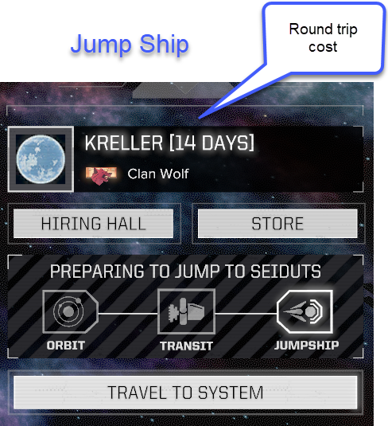
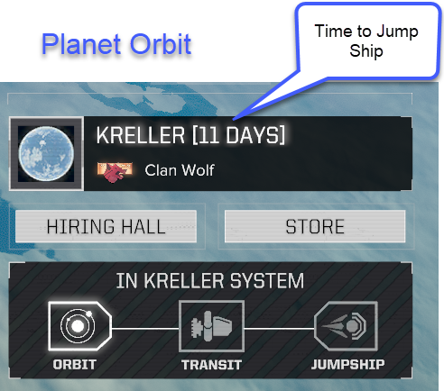

# Time To Planet

Changes the planet text on the Argo screen to include the travel time.

Not sure if there is enough time to land on a planet when on route to a flashpoint with a tight deadline?  Unsure if round trip travel to a planet will take 4 days or 14 days?  Then this mod is for you.  

# Screen Shots

 
 

# Compatibility 
Safe to add and remove from existing saves.

The mod only changes the UI and not the functionallity.  
It should be compatible with all mods.  The exception would be any mod that changes the planet text on the Argo screen.

# Travel to Planet Time Bug

Rarely the game will incorrectly set the "to planet" travel time (usally 3 days) to the "to jump ship" time (usually 5+ days). The bug will cause a longer travel time than is correct and is not reflected in the UI.

This occurs rarely and is most likely due to some other mod corrupting the travel time data and seems to occur more when loading a save game.

This mod makes the bug apperant but does not cause the issue.
