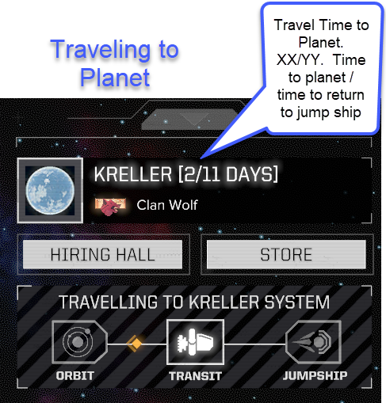

# Time To Planet

Changes the planet text on the Argo screen to include the travel time.

Not sure if there is enough time to land on a planet when on route to a flashpoint with a tight deadline?  Unsure if round trip travel to a planet will take 4 days or 14 days?  Then this mod is for you.  

# Screen Shots

 
 

# Compatibility 
Safe to add and remove from existing saves.

The mod only changes the UI and not the functionallity.  
It should be compatible with all mods.  The exception would be any mod that changes the planet text on the Argo screen.

# Travel to Planet Time - End of Navigation vs Abort Navigation

Oddly the game has two different times to travel to a planet:

* Automatic travel to planet at the end of navigation.
* Aborted navigation to travel to the system.

The automatic departure takes "Jump Distance" days, which can be as high as 18 days.
The "Travel to System" button which aborts navigation takes a constant 3 days.

This does not affect the use of the mod as it's primary purpose is to allow a user to determine if they want to abort navigation.
